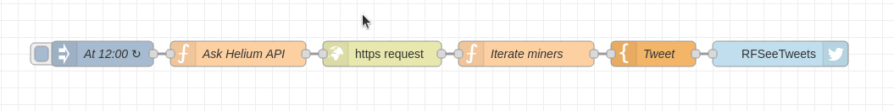
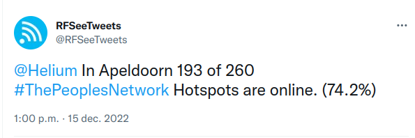

# Hotspot counter
This flow reports at a regular interval the number of active Helium hotspots as reported by the Helium API. The result is reported using a Twitter-bot node in Node-red.

## About the Helium API
Documentation on the Helium api can be found here: https://docs.helium.com/api/blockchain/cities

To request the number of hotspots in your city you need the Helium city\_id. To find the city\_id for your town enter the following url in your browser. Substitute "Apeldoorn" with the city you are looking for: 
```
https://api.helium.io/v1/cities?search=Apeldoorn
```

The city_id is used in the following url to retrieve a list of hotspots: 
```
https://api.helium.io/v1/cities/YXBlbGRvb3JuZ2VsZGVybGFuZG5ldGhlcmxhbmRz/hotspots
```

## About the flow
The flow requests at a regular interval the information from the Helium API with a inject-node. The HTTP-node receives the url from the function node. The answer from the Helium API is a json struct from which the number of hotspots and the number of active hotspots is counted. These numbers are presented to the Mustache node that creates the content of teh Tweet. 



## Tweet
The message is Tweeted using a Twitter node.



To setup a Twitter bot this howto my be usefull: https://blog.hubspot.com/website/how-to-make-a-twitter-bot 
### Disclaimer
This Node-red flow is distributed in the hope that it will be useful, but WITHOUT ANY WARRANTY; without even the 
implied warranty of MERCHANTABILITY or FITNESS FOR A PARTICULAR PURPOSE.

### License
This Node-red is free software and hardware: 
you can redistribute it and/or modify it under the terms of a Creative Commons Attribution-NonCommercial 4.0 International License (http://creativecommons.org/licenses/by-nc/4.0/) by PE1MEW (http://pe1mew.nl) E-mail: pe1mew@pe1mew.nl

<a rel="license" href="http://creativecommons.org/licenses/by-nc/4.0/"></a><br />This work is licensed under a <a rel="license" href="http://creativecommons.org/licenses/by-nc/4.0/">Creative Commons Attribution-NonCommercial 4.0 International License</a>.


